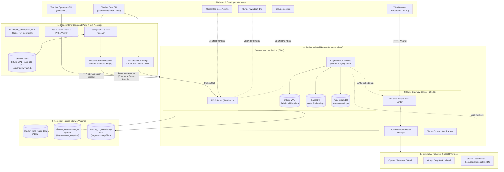
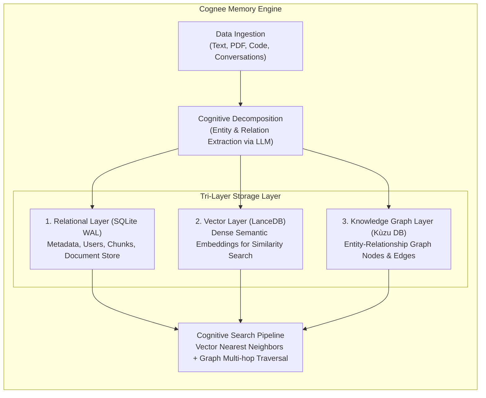
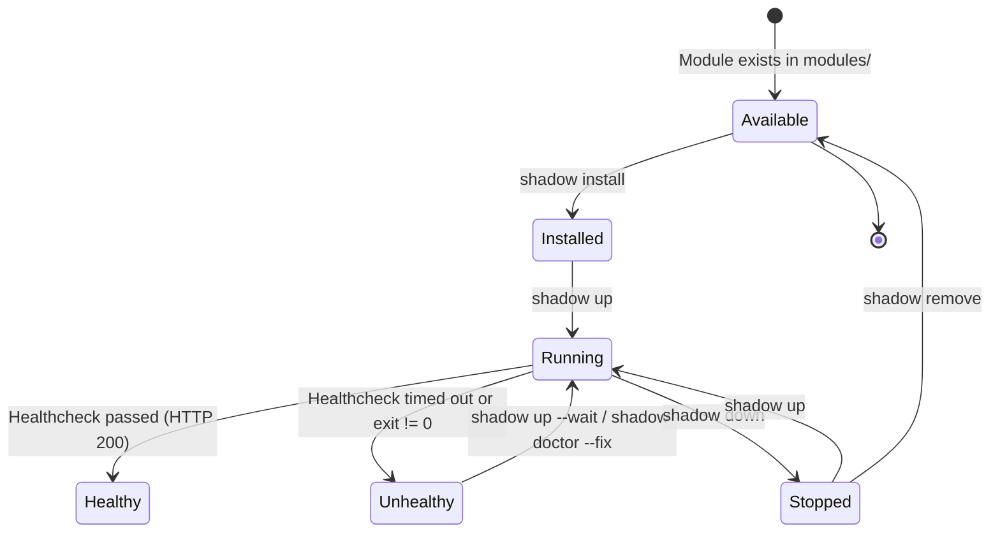

# Shadow Core: System Architecture & Technical Specifications

> **Version**: 1.0.0-rc  
> **Status**: Stable / Production Architecture  
> **Author**: Agung & The Shadow Core Core Team  
> **License**: Apache-2.0

---

## 📑 Table of Contents

1. [Architectural Philosophy](#1-architectural-philosophy)
2. [High-Level System Topology](#2-high-level-system-topology)
3. [Grimoire Vault (Zero-Plaintext Security Engine)](#3-grimoire-vault-zero-plaintext-security-engine)
4. [9Router AI Gateway Engine](#4-9router-ai-gateway-engine)
5. [Cognee Tri-Layer Memory Engine](#5-cognee-tri-layer-memory-engine)
6. [Universal Model Context Protocol (MCP) Bridge](#6-universal-model-context-protocol-mcp-bridge)
7. [Module Lifecycle & Composition Engine](#7-module-lifecycle--composition-engine)
8. [Network Boundaries & Resource Footprint](#8-network-boundaries--resource-footprint)
9. [Autonomous Module Generation (AI Synthesizer)](#9-autonomous-module-generation-ai-synthesizer)

---

## 1. Architectural Philosophy

Shadow Core was built to solve the fragmentation, security vulnerabilities, and resource bloat inherent in modern self-hosted AI stacks. Its architecture is anchored in four non-negotiable principles:

```
┌─────────────────────────────────────────────────────────────────────────┐
│                      CORE ARCHITECTURAL PILLARS                        │
├───────────────────┬───────────────────┬────────────────┬────────────────┤
│  ZERO EXTERNAL    │  ZERO PLAINTEXT   │  LOCAL-FIRST   │    MINIMAL     │
│   DEPENDENCIES    │     SECURITY      │   ISOLATION    │   FOOTPRINT    │
│  Pure Node.js     │  AES-256-GCM      │  Loopback only │  ~1.4 GiB RAM  │
│  stdlib (crypto,  │  vault, secretRef │  127.0.0.1, no │  for Gateway + │
│  sqlite, fs, net) │  ephemeral inject │  cloud phoning │  Graph+Vector  │
└───────────────────┴───────────────────┴────────────────┴────────────────┘
```

1. **Zero External Dependencies (`0 npm dependencies`)**:
   The entire CLI engine, cryptographic vault, Docker Compose orchestrator, HTTP client, and MCP bridge are built using **pure Node.js standard libraries** (`node:crypto`, `node:sqlite`, `node:fs`, `node:path`, `node:child_process`, `node:http`). There is zero dependency supply-chain attack surface (`node_modules` is empty in production).

2. **Zero-Plaintext Security Contract**:
   API keys, passwords, and connection secrets are **never** stored in plaintext inside `.env` files or Git repositories. Plaintext secrets exist only ephemerally in container memory upon process execution.

3. **Local-First & Private by Default**:
   All container services bind strictly to `127.0.0.1` (loopback). No telemetry, no remote phoning, and no unauthorized inbound traffic can reach the AI plane from external network interfaces.

4. **Deterministic & Observable Operations**:
   Every CLI command performs synchronous healthcheck probes, inspects real container exit codes, and provides actionable root-cause analysis rather than opaque failure states.

---

## 2. High-Level System Topology

The diagram below illustrates the end-to-end topology of Shadow Core, from developer clients down to persistent storage volumes:



---

## 3. Grimoire Vault (Zero-Plaintext Security Engine)

### 3.1 Cryptographic Design

The Grimoire Vault eliminates plaintext credential storage in `.env` files. Secrets are encrypted using **AES-256-GCM** (Galois/Counter Mode), guaranteeing both **confidentiality** and **tamper-evident authenticity**.

```
┌────────────────────────────────────────────────────────────────────────┐
│                      GRIMOIRE VAULT ENCRYPTION FLOW                    │
├────────────────────────────────────────────────────────────────────────┤
│ 1. Master Key (32 bytes hex) ────┐                                    │
│                                  ▼                                     │
│ 2. Plaintext Secret + IV (12B) ──► AES-256-GCM ──► Ciphertext + AuthTag│
│                                                     (16 bytes)         │
│ 3. Storage: SQLite WAL (data/shadow-vault.db)                          │
│    Columns: id, ciphertext_base64, iv_hex, tag_hex, created_at        │
│ 4. Reference in .env:                                                  │
│    KEY=secretRef:<id>                                                  │
│ 5. Runtime Injection:                                                  │
│    Decrypted in-memory ONLY during child_process spawning              │
└────────────────────────────────────────────────────────────────────────┘
```

### 3.2 Secret Reference Protocol (`secretRef:`)

When a developer sets a secret:
```bash
shadow creds set cognee-llm-api-key "sk-proj-xyz..."
```
The following sequence occurs:
1. A unique 12-byte initialization vector (`IV`) is generated cryptographically via `crypto.randomBytes(12)`.
2. The secret payload is encrypted with `AES-256-GCM` using the master key (`SHADOW_GRIMOIRE_KEY`).
3. An authentication tag (`tag`, 16 bytes) is produced.
4. The encrypted record is stored in `data/shadow-vault.db` inside an embedded SQLite table.
5. The `.env` file is atomically updated to store:
   ```dotenv
   COGNEE_LLM_API_KEY=secretRef:cognee-llm-api-key
   ```
6. On Unix/Linux/macOS platforms, `.env` file permissions are enforced to `chmod 600` (read/write only by owner).

### 3.3 Ephemeral Process Injection

During `shadow up`, Shadow Core parses `.env`, identifies every key prefixed with `secretRef:`, fetches and decrypts the value in host RAM, and passes the resolved environment variables directly to the Docker Compose CLI subprocess environment (`process.env`). **The plaintext secret is never written to disk, cache files, or logs.**

---

## 4. 9Router AI Gateway Engine

**9Router** serves as the intelligent AI model routing plane. It provides an OpenAI-compatible proxy interface that sits between client applications and heterogeneous model providers.

### 4.1 Capabilities
- **Multi-Provider Unification**: Unified routing across OpenAI, Anthropic, Google Gemini, Groq, DeepSeek, Together AI, and self-hosted Ollama.
- **Dynamic Fallback Chains**: If an upstream provider returns `429 Too Many Requests` or `500 Server Error`, 9Router automatically fails over to configured secondary providers without interrupting the agent.
- **Token & Cost Accounting**: Live metrics on request counts, prompt/completion tokens, and estimated cost per model.
- **Loopback Web Dashboard**: A built-in administration UI bound to `http://127.0.0.1:20140`.

### 4.2 Initial Setup & Credential Synchronization
During `shadow init`, a cryptographically secure 16-character hexadecimal password is generated for the 9Router admin account and saved into Grimoire Vault (`secretRef:nine-router-initial-password`). The user can retrieve this anytime with:
```bash
shadow creds reveal nine-router-initial-password
```

---

## 5. Cognee Tri-Layer Memory Engine

**Cognee** provides cognitive, persistent memory for autonomous agents through a hybrid architecture combining relational, vector, and graph databases.



### 5.1 Storage Breakdown
1. **Relational Database (`SQLite WAL`)**: Stores metadata, execution traces, raw chunk references, and user scoping in `/cognee-storage/system`.
2. **Vector Database (`LanceDB`)**: Serverless vector database optimized for columnar disk reads and fast approximate nearest-neighbor (ANN) search over embeddings in `/cognee-storage/data`.
3. **Graph Database (`Kùzu Graph Engine`)**: Embedded graph database written in C++ for ultra-fast multi-hop relationship queries between extracted entities.

### 5.2 Storage Persistence & Permissions
Cognee runs as container `shadow-cognee-mcp-1` with explicit volume bindings:
- `shadow_cognee-storage-system` ➔ `/cognee-storage/system`
- `shadow_cognee-storage-data` ➔ `/cognee-storage/data`

To prevent `PermissionError: [Errno 13] Permission denied` on Linux systems where Docker volumes are initialized with root permissions, Shadow Core explicitly enforces `user: "0:0"` inside `docker-compose.cognee.yml`, guaranteeing consistent read/write access across container restarts.

---

## 6. Universal Model Context Protocol (MCP) Bridge

The **Model Context Protocol (MCP)** is an open standard created by Anthropic that enables AI models and autonomous agents to safely access tools, databases, and context.

Shadow Core acts as both an **MCP Gateway/Orchestrator** and an **MCP Diagnostic Client**.

### 6.1 Tool Classification System

Shadow Core categorizes all exposed MCP tools into three distinct operational profiles:

| Classification Badge | Operational Nature | Latency Profile | Cost & Privacy Profile | Example Tools |
|---|---|---|---|---|
| `[OFFLINE]` | Purely deterministic local computation. No network or model calls required. | < 5 ms | 0 tokens, 100% offline, zero data egress | `status`, `health`, `cache_lookup`, `ping` |
| `[HYBRID]` | Local vector indexing, relational lookup, or graph traversal. | 10 - 50 ms | 0 LLM tokens, uses local disk/memory | `recall`, `search_graph`, `find_chunk` |
| `[LLM REASONING]` | Requires cognitive synthesis or model inference via 9Router or OpenAI. | 500 - 3000 ms | Consumes LLM/embedding tokens via upstream provider | `remember`, `improve`, `cognify` |

### 6.2 CLI Direct Tool Invocation

Developers can test and execute MCP tools directly from the command line without launching Claude Desktop or Cursor:

```bash
# Ping MCP endpoint and test JSON-RPC handshake
shadow mcp ping cognee

# Inspect registered tools with classification badges
shadow mcp tools cognee

# Directly execute an MCP tool
shadow mcp call cognee recall '{"query": "database connection settings"}'
```

### 6.3 SSE & JSON-RPC Protocol Handling
Shadow Core's MCP bridge implements JSON-RPC 2.0 with full support for Server-Sent Events (SSE) streaming, accepting `application/json` and `text/event-stream` with automatic session handshake negotiation to ensure complete compatibility across disparate MCP server implementations.

---

## 7. Module Lifecycle & Composition Engine

Shadow Core manages service composition dynamically through modular recipe descriptors (`recipe.json`).

```
modules/
├── core/                  # Headless core profile (always enabled)
├── 9router/              # AI Model Gateway recipe & Compose spec
└── cognee/               # Persistent Memory recipe & Compose spec
```

### 7.1 Module State Machine



### 7.2 Docker Compose Merge Pipeline
When `shadow up` is invoked:
1. Shadow Core reads `SHADOW_ENABLED_MODULES` from `.env`.
2. It resolves dependency ordering (e.g., `cognee` depends on `9router`).
3. It constructs an dynamic Compose command incorporating only active module compose files:
   ```bash
   docker compose -f docker-compose.yml -f modules/cognee/docker-compose.cognee.yml up -d
   ```
4. It polls each service's healthcheck status and performs active HTTP smoketests before reporting readiness.

---

## 8. Network Boundaries & Resource Footprint

### 8.1 Network Isolation Matrix

| Service | Port | Host Binding | Network Scope | Authentication |
|---|---|---|---|---|
| **9Router Web UI** | `20140` | `127.0.0.1:20140` | Localhost Loopback | Session Password (Vault) |
| **9Router Proxy API** | `20128` | Docker Internal | `shadow-bridge` network | API Key / Bearer Token |
| **Cognee MCP API** | `8001` | `127.0.0.1:8001` | Localhost Loopback | MCP Protocol Handshake |

No service is ever bound to `0.0.0.0` by default. Exposing services to the public internet requires intentional reverse proxy configuration (e.g., Nginx, Caddy with TLS and mTLS).

### 8.2 Resource Benchmark (Production Tested)

Measurements taken on an Ubuntu 24.04 LTS instance running the complete Shadow Core stack (`core` + `9router` + `cognee`):

```text
================================================================================
  SHADOW CORE - RESOURCE ALLOCATION BENCHMARK (LIVE OBSERVED)
================================================================================
Container               Image                   CPU %    MEM USAGE / LIMIT
--------------------------------------------------------------------------------
shadow-nine-router-1    9router:latest          0.08%    142.3 MiB / 3.6 GiB
shadow-cognee-mcp-1     cognee-mcp:latest       0.15%    1.08  GiB / 3.6 GiB
Host Base System        Ubuntu 24.04 (Kernel)   0.20%    195.0 MiB / 3.6 GiB
--------------------------------------------------------------------------------
TOTAL RAM UTILIZATION   1.41 GiB (Active)       AVAILABLE RAM: 2.19 GiB
SWAP USAGE              524 KiB                 TOTAL SYSTEM RAM: 3.6 GiB
================================================================================
```

---

## 9. Autonomous Module Generation (AI Synthesizer)

Shadow Core includes a native recipe generator powered by 9Router:

```bash
shadow module create <id> --source <github-repo-or-docker-compose-url>
```

### Synthesis Pipeline:
1. **Source Ingestion**: Fetches remote `docker-compose.yml`, `README.md`, or repository metadata via `fetch`.
2. **AI Specification Analysis**: Prompts 9Router with strict system instructions to infer required environment variables, volume persistence paths, port mappings, and healthcheck endpoints.
3. **Recipe Validation**: Emits a compliant `recipe.json` and `docker-compose.<id>.yml` bound strictly to `127.0.0.1`, validates JSON schema, and tests compose syntax before registering into the local module registry.

---

*For installation instructions, see [docs/installation.md](file:///E:/GitHub/shadow-core/docs/installation.md).*  
*For Model Context Protocol integration, see [docs/mcp-guide.md](file:///E:/GitHub/shadow-core/docs/mcp-guide.md).*