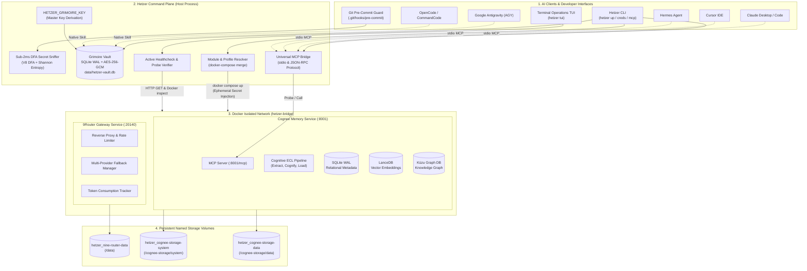

# Hetzer: System Architecture & Technical Specifications

> **Version**: 0.3.0  
> **Status**: Stable / Production Architecture  
> **Author**: Agung & The Hetzer Core Team  
> **License**: Apache-2.0

---

## 📑 Table of Contents

1. [Architectural Philosophy](#1-architectural-philosophy)
2. [High-Level System Topology](#2-high-level-system-topology)
3. [Grimoire Vault (Zero-Plaintext Security Engine)](#3-grimoire-vault-zero-plaintext-security-engine)
4. [Transparent Secret Sniffer (< 2ms Latency Engine)](#4-transparent-secret-sniffer--2ms-latency-engine)
5. [Git Pre-Commit Guard Hook Architecture](#5-git-pre-commit-guard-hook-architecture)
6. [Universal AI Agent Skills (Headless Architecture)](#6-universal-ai-agent-skills-headless-architecture)
7. [9Router AI Gateway Engine](#7-9router-ai-gateway-engine)
8. [Cognee Tri-Layer Memory Engine](#8-cognee-tri-layer-memory-engine)
9. [Universal Model Context Protocol (MCP) Bridge](#9-universal-model-context-protocol-mcp-bridge)
10. [Network Boundaries & Resource Footprint](#10-network-boundaries--resource-footprint)

---

## 1. Architectural Philosophy

Hetzer was built to solve the fragmentation, security vulnerabilities, and resource bloat inherent in modern AI agent tools and developer workflows. Its architecture is anchored in four non-negotiable principles:

```
┌─────────────────────────────────────────────────────────────────────────┐
│                      CORE ARCHITECTURAL PILLARS                        │
├───────────────────┬───────────────────┬────────────────┬────────────────┤
│  ZERO EXTERNAL    │  ZERO PLAINTEXT   │  LOCAL-FIRST   │    MINIMAL     │
│   DEPENDENCIES    │     SECURITY      │   ISOLATION    │   FOOTPRINT    │
│  Pure Node.js     │  AES-256-GCM      │  Loopback only │  < 10 MiB RAM  │
│  stdlib (crypto,  │  vault, secretRef │  127.0.0.1, no │  for Headless; │
│  sqlite, fs, net) │  ephemeral inject │  cloud phoning │  ~1.4G for full│
└───────────────────┴───────────────────┴────────────────┴────────────────┘
```

1. **Zero External Dependencies (`0 npm dependencies`)**:
   The entire CLI engine, cryptographic vault, secret sniffer, Docker Compose orchestrator, HTTP client, and MCP bridge are built using **pure Node.js standard libraries** (`node:crypto`, `node:sqlite`, `node:fs`, `node:path`, `node:child_process`, `node:perf_hooks`). There is zero dependency supply-chain attack surface (`node_modules` is empty in production).

2. **Zero-Plaintext Security Contract**:
   API keys, passwords, and private tokens are **never** stored in plaintext inside `.env` files, Git commits, or LLM chat windows. Plaintext secrets exist only ephemerally in subprocess memory upon process execution.

3. **Sub-2ms Silicon Performance**:
   Scanning, entropy evaluation, and cryptographic operations run under 2 milliseconds utilizing C++ V8 DFA regular expressions and hardware **AES-NI** CPU instructions.

4. **Local-First & Private by Default**:
   All services bind strictly to `127.0.0.1` (loopback). No telemetry, no remote phoning, and no unauthorized inbound traffic can reach the AI plane from external network interfaces.

---

## 2. High-Level System Topology

The diagram below illustrates the end-to-end topology of Hetzer, from developer clients down to persistent storage volumes:



---

## 3. Grimoire Vault (Zero-Plaintext Security Engine)

### 3.1 Cryptographic Design

The Grimoire Vault eliminates plaintext credential storage. Secrets are encrypted using **AES-256-GCM** (Galois/Counter Mode), guaranteeing both **confidentiality** and **tamper-evident authenticity**.

```
┌────────────────────────────────────────────────────────────────────────┐
│                      GRIMOIRE VAULT ENCRYPTION FLOW                    │
├────────────────────────────────────────────────────────────────────────┤
│ 1. Master Key (32 bytes hex) ────┐                                    │
│                                  ▼                                     │
│ 2. Plaintext Secret + IV (12B) ──► AES-256-GCM ──► Ciphertext + AuthTag│
│                                                     (16 bytes)         │
│ 3. Storage: SQLite WAL (data/hetzer-vault.db)                          │
│    Columns: id, ciphertext_base64, iv_hex, tag_hex, created_at        │
│ 4. Reference in .env:                                                  │
│    KEY=secretRef:<id>                                                  │
│ 5. Runtime Injection:                                                  │
│    Decrypted in-memory ONLY during child_process spawning              │
└────────────────────────────────────────────────────────────────────────┘
```

### 3.2 Secret Reference Protocol (`secretRef:`)

When a developer sets a secret:
```bash
hetzer creds set cognee-llm-api-key "sk-proj-xyz..."
```
The following sequence occurs:
1. A unique 12-byte initialization vector (`IV`) is generated cryptographically via `crypto.randomBytes(12)`.
2. The secret payload is encrypted with `AES-256-GCM` using the master key (`HETZER_GRIMOIRE_KEY`).
3. An authentication tag (`tag`, 16 bytes) is produced.
4. The encrypted record is stored in `data/hetzer-vault.db` inside an embedded SQLite table.
5. The `.env` file is atomically updated to store:
   ```dotenv
   COGNEE_LLM_API_KEY=secretRef:cognee-llm-api-key
   ```
6. On POSIX systems, `.env` file permissions are enforced to `chmod 600` (read/write only by owner).

### 3.3 Ephemeral Process Injection

During `hetzer up` or `hetzer exec`, Hetzer parses `.env`, identifies every key prefixed with `secretRef:`, fetches and decrypts the value in host RAM, and passes the resolved environment variables directly to the child process environment (`process.env`). **The plaintext secret is never written to disk, cache files, or logs.**

---

## 4. Transparent Secret Sniffer (< 2ms Latency Engine)

Located at `cli/vault/sniffer.mjs`, the Secret Sniffer intercepts tokens in real-time:

1. **Deterministic Fast-Path**: Uses V8 compiled DFA regexes to identify token prefixes (`sk-`, `ghp_`, `npm_`, `AIza`, `Bearer `, `BEGIN PRIVATE KEY`).
2. **Shannon Entropy Check**: High-entropy strings are analyzed to minimize false positives while capturing randomized API keys.
3. **Hardware AES-NI**: Auto-vaulting occurs via native Node.js crypto calling hardware AES-NI instructions.
4. **Latency Guarantee**: Execution completes in under **2 milliseconds** on standard developer laptops.

---

## 5. Git Pre-Commit Guard Hook Architecture

Located at `cli/core/git-hook.mjs`, the pre-commit hook provides local defense before Git commits are formed:

1. **Staged File Inspection**: Inspects `git diff --cached --name-only` to immediately block staged `.env` files.
2. **Added-Line Diff Scanning**: Evaluates only added lines (`+` lines) from `git diff --cached -U0`.
3. **Deterministic Abort**: If a candidate credential is found, git commit is terminated with exit code 1, accompanied by actionable fix suggestions.

---

## 6. Universal AI Agent Skills (Headless Architecture)

Hetzer implements the open Agent Skills standard (`<name>/SKILL.md`):

- **Zero Container Requirement**: Runs on the user's existing LLM client (Claude 3.7, GPT-4o, Gemini 2.0).
- **Idempotent Pointer Blocks**: Injects standard session markers (`<!-- hetzer:start --> ... <!-- hetzer:end -->`) into `AGENTS.md`, `CLAUDE.md`, or `GEMINI.md`.
- **Proactive MCP Tools**: Exposes `hetzer_sniffer_scan`, `hetzer_sniffer_redact`, `hetzer_vault_has`, and `hetzer_vault_list` over stdio MCP.

---

## 7. 9Router AI Gateway Engine

9Router acts as an intelligent local reverse proxy and load balancer across AI providers:
- **Port**: Loopback `127.0.0.1:20140`.
- **Providers**: OpenAI, Anthropic, Google Gemini, Groq, DeepSeek, Mistral, Ollama.
- **Failover**: Configurable fallback routes when upstream APIs encounter rate limits or outages.

---

## 8. Cognee Tri-Layer Memory Engine

Cognee implements cognitive memory for long-running agents:
- **Relational Layer**: SQLite WAL for structured metadata and timestamps.
- **Vector Layer**: LanceDB for high-dimensional semantic search.
- **Graph Layer**: Kùzu Graph DB for entity relationship traversal.

---

## 9. Universal Model Context Protocol (MCP) Bridge

Hetzer hosts an embedded MCP server implementing the JSON-RPC 2.0 protocol over stdio. Clients connect directly via `node cli/bin/hetzer.js mcp serve`, providing sub-millisecond tool discovery and invocation.

---

## 10. Network Boundaries & Resource Footprint

- **Loopback Enforcement**: All container ports bind exclusively to `127.0.0.1`.
- **RAM Allocation**:
  - Headless Agent Skill: **< 10 MiB RAM**.
  - Core Gateway (9Router): **~200 MiB RAM**.
  - Full Stack (+ Cognee Memory): **~1.4 GiB RAM**.